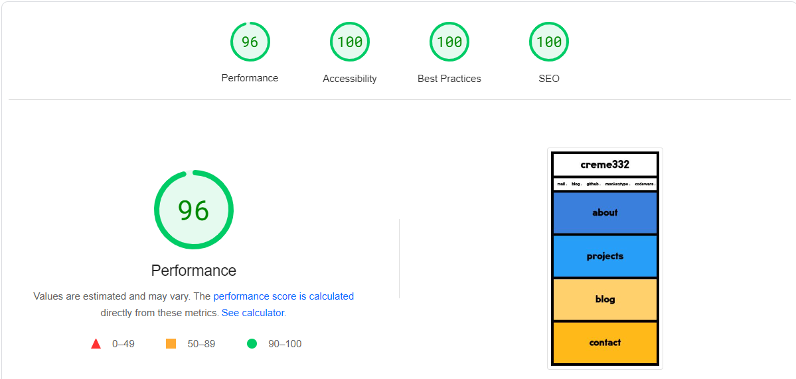

# Portfolio 💛

A responsive personal website using a neobrutalist design. It was built with performance in mind.

[Live Preview ▶](https://creme332.vercel.app/)

## Features
- Neobrutalist design
- SEO optimized
- Mobile responsive UI
- Smooth animations
- Accessible website
- Progressive Web App (installable + offline support)
- Functional contact form with reCAPTCHA v3 and ratelimiting
  

## To-do
- [ ] Update `changefreq` in sitemap
- [ ] Place all user details in a single file.
- [ ] Social card when sharing website lacks tiny icon
- [ ] Close button is not visible on mobile devices when project image has dark theme. maybe add white outline to close button.
- [ ] Homepage font size not reponsive when zooming out

## Credits
- UI: https://plant22.co
- SVG shapes on project page: https://fffuel.co/dddynamite/
- Image on about page: https://www.uhdpaper.com/2021/06/monster-abstract-digital-art-4k-5300a.html?m=1
- Image on contact page: [Freepik](https://www.freepik.com/premium-vector/colorful-geometric-background-modern-abstract-background-with-geometric-shapes-lines_31713840.htm)
